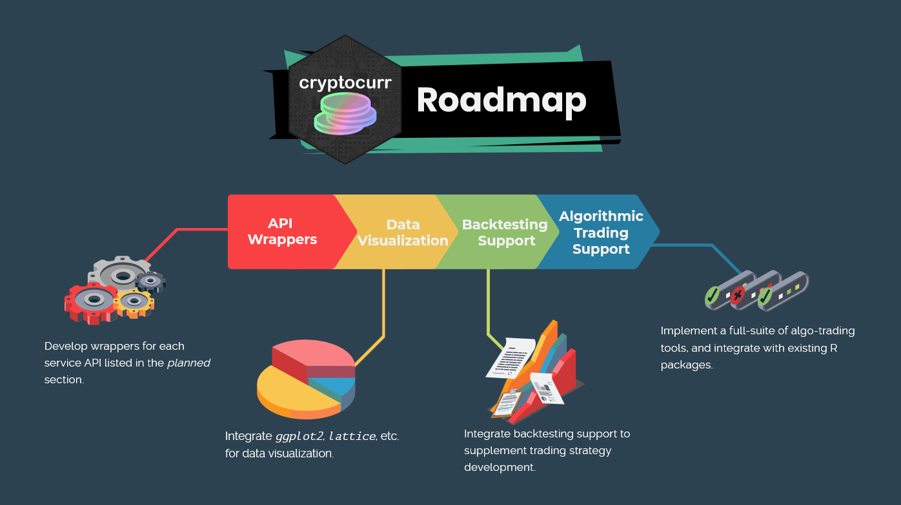

# cryptocurr  <a href="https://cryptocurr.justinsingh.me"></a>

<!-- badges: start -->
[](https://travis-ci.com/program--/cryptocurr)
[](https://codecov.io/gh/program--/cryptocurr)
[](https://www.repostatus.org/#wip)
<!-- badges: end -->

`cryptocurr` is an API Wrapper written in R for various cryptocurrency exchange platforms.
Built with the [`tidyverse`](https://www.tidyverse.org/) in mind, data gathered from `cryptocurr`
integrates seemlessly within the core and related universes, such as
with [`tidyquant`](https://business-science.github.io/tidyquant/) and
[`timetk`](https://business-science.github.io/timetk/).

## Installation

To install the developmental version:

```r
remotes::install_github("program--/cryptocurr")
```

## Supported Platforms
| Name | API |
| ---| --- |
| [Bitfinex](https://www.bitfinex.com/) | [v2](https://docs.bitfinex.com/reference) |

## Planned Platforms
| Name | Phase |
| --- | --- |
| [Coinbase](https://www.coinbase.com/) | ❌ Not Started  |
| [Kraken](https://www.kraken.com)      | ❌ Not Started  |
| [Binance](https://www.binance.com/)   | ❌ Not Started  |

## Example

This is a basic example which shows you how to solve a common problem:

``` r
library(cryptocurr)
## basic example code
```

## Roadmap

